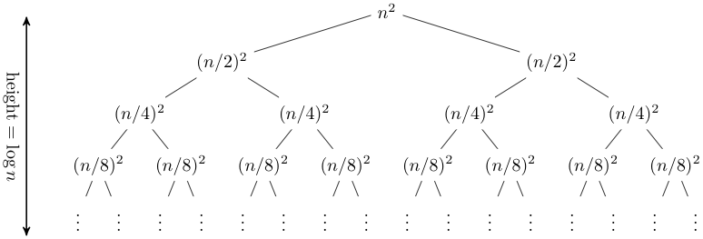

# 递归

## 递归分析

### 递归跟踪

### 递推方程

$T(n) = T(n-1) + O(1) = T(n-1) + c_1$

$T(0) = O(1) = c_2$

$T(n) = c_1 n + c_2 = O(n)$

### 递归树



### 主定理

设有递推式 $T(n) = aT(\frac{n}{b})+f(n)，a \ge 1，b > 1$。

#### 情形一

若存在常数 $\varepsilon > 0$，有 $f(n) = O(n^{\log_b{a}-\varepsilon})$（多项式地小于），则 $T(n) = \Theta(n^{\log_b{a}})$。

#### 情形二

若存在常数 $k \ge 0$，有 $f(n) = \Theta(n^{\log_b{a}} \log^k{n})$，则 $T(n) = \Theta(n^{\log_b{a}} \log^{k+1}{n})$。

#### 情形三

如存在常数 $\varepsilon > 0$，有 $f(n) = \Omega(n^{\log_b{a}+\varepsilon})$（多项式地大于），同时存在常数 $c < 1$，以及充分大的 $n$，满足 $af(\frac{n}{b}) \le cf(n)$，则 $T(n) = \Theta(f(n))$。

## 递归消除

- 使用迭代（易于消除尾递归）
- 使用栈结构模拟递归调用

## 实例

### 汉诺塔

```cpp
void moveTower(int n, char start, char finish, char tmp) {
    if (n == 1) {
        moveSingleDisk(start, finish);
    } else {
        moveTower(n - 1, start, tmp, finish);
        moveSingleDisk(start, finish);
        moveTower(n - 1, tmp, finish, start);
    }
}
```

### 子集求和问题

```cpp
bool subsetSumExists(Set<int> &set, int target) {
    if (set.isEmpty()) {
        return target == 0;
    } else {
        int elem = set.first();
        set.remove(elem);
        return subsetSumExists(set, target) || subsetSumExists(set, target - elem);
    }
}
```

这种模式称为包含/排除模式（inclusion/exclusion pattern）。

### 字符排列

```cpp
Set<string> generatePermutations(string chars) {
    Set<string> result;
    if (chars.empty()) {
        result.add("");
    } else {
        for (int i = 0; i < chars.length(); i++) {
            char ch = chars[i];
            string rest = chars.substr(0, i) + chars.substr(i + 1);
            for (string s : generatePermutations(rest)) {
                result.add(ch + s);
            }
        }
    }
    return result;
}
```

### 数字的排列和组合

```cpp
void permutation(const vector<int> &S, vector<bool> &marked, vector<int> &v) {
    int n = S.size();
    for (int i = 0; i < n; i++) {
        if (marked[i]) continue;
        marked[i] = true;
        v.push_back(S[i]);
        if (v.size() == n) {
            print(v);
        } else {
            permutation(S, marked, v);
        }
        v.pop_back();
        marked[i] = false;
    }
}

void composition(const vector<int> &S, int k, vector<int> &v, int start = 0) {
    int n = S.size();
    for (int i = start; i < n; i++) {
        v.push_back(S[i]);
        if (v.size() == k) {
            print(v);
        } else {
            composition(S, k, v, i + 1);
        }
        v.pop_back();
    }
}
```
