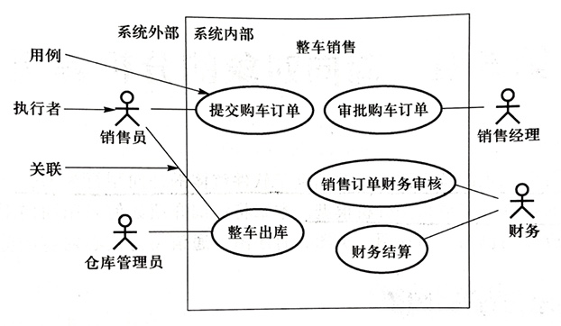
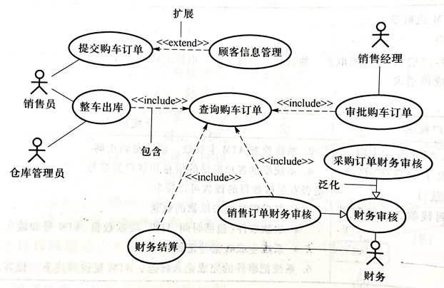
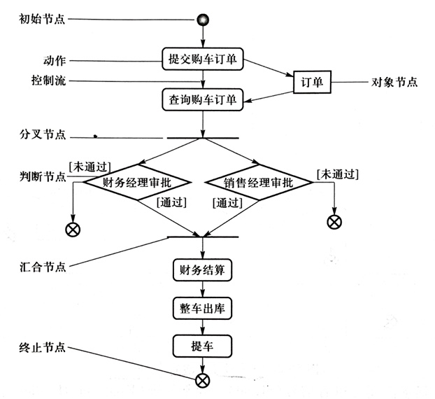
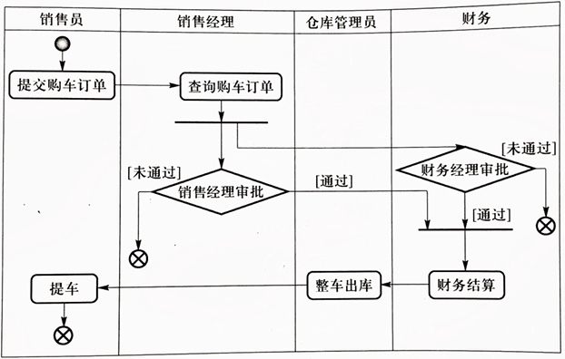
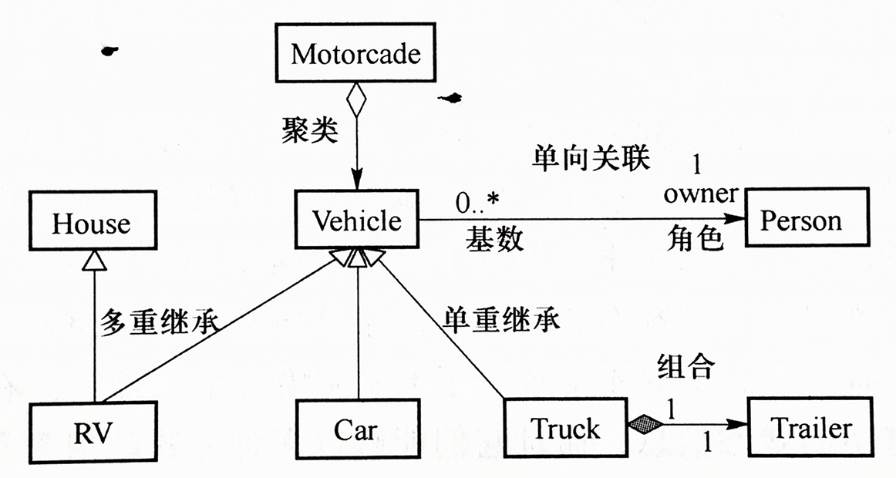
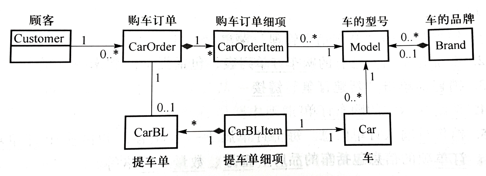
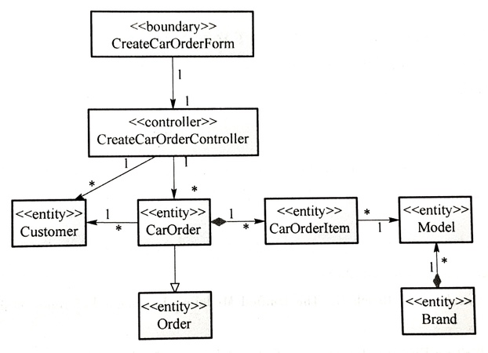
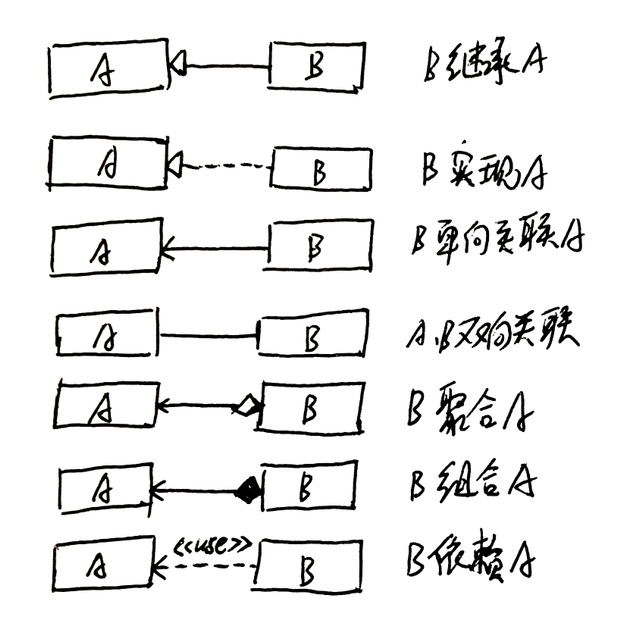
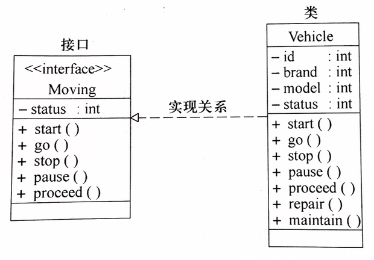

# 面向对象分析

## 用例图

基本元素：

- 执行者：与系统交互的实体，可以是人、外界的硬件设备或系统
- 用例：代表执行者希望系统为他们做什么，用椭圆表示。从执行者看来，用例必须是一个完整的活动流程
- 关系：包括执行者和用例间的关系、用例和用例间的关系以及执行者和执行者间的关系。执行者和用例间只有一种关系：关联；用例间有三种关系：包含、扩展、泛化；执行者间只有一种关系：泛化

用例间的三种关系：

- 包含：复用已有用例
- 扩展：可以理解为可选的/有条件的包含（但箭头方向相反，扩展是从扩展用例指向基本用例）
- 泛化：子用例继承父用例的行为和含义，并增加或覆盖部分行为

优化后的用例图：

## 活动图

活动图可利用分区或称泳道来分组：

## 类图

类图的基本元素是类和类之间的关系。类之间的关系包括继承/泛化、关联、依赖。

### 类的关系

#### 继承/泛化

A is a kind of B.

用空三角箭头表示。

Liskov 替换准则要求：在继承时，子类应该能出现在原本父类出现的场合。

#### 关联

两个相对独立的类，当一个类的实例与另外一个类的特定实例存在固定关系时，这两个类之间存在关联关系。

关联的多重度（基数）表示两个类之间的数量关系，写在表示关联的实线两端，例如：

关联可分为单向关联和双向关联。单向关联中，只有一个类知道联系的存在，用单向箭头表示；双向关联中，两个类都知道关联的存在，用不带箭头的实线表示。

聚合是一种特殊的关联，表示部分与整体的关系（A is a part of B），用带空菱形的实线表示，空菱形与聚合类相连接。

组合是一种更强形式的聚合，整体有管理部分的职责，用带实菱形的实线表示。

聚合和组合的区别在于，整体和部分的生命周期是否独立，发生聚合的两个类独立存在（例如车队和卡车的关系，车队解散了，卡车仍然可以独立存在），而组合关系中，部分依赖于整体而存在，整体消亡时部分也随之消亡（例如卡车和拖车的关系，拖车不能离开卡车单独存在）。

#### 依赖

用虚线箭头表示，用一个衍型的关键字来区分它的种类：

依赖和关联的区别在于，依赖是一种临时的非结构型关系（例如在局部变量、全局变量、函数参数中使用另一个类），而关联时一种永久的结构型关系（例如类的成员变量）。

#### 接口和实现

用带空三角的虚线表示：

### 分析类的识别

MVC 设计模式中，M、V、C 分别对应实体类、边界类、控制类。

- 边界类：用于描述系统外部环境与系统的交互，主要负责内容的翻译和形式的转换，并表达相应结果，包括：
  - 用户界面类
  - 系统接口类
  - 设备接口类
- 控制类：用于描述一个或几个用例所特有的事件流控制行为，如事务管理器、资源协调器和错误处理器等
- 实体类：用于描述必须存储的信息和相关行为

## 时序图

## 通信图

## 包图

## 分析建模的步骤

- 用例建模
- 建立概念模型
- 识别用例实现
- 识别分析类
- 完成用例分析
