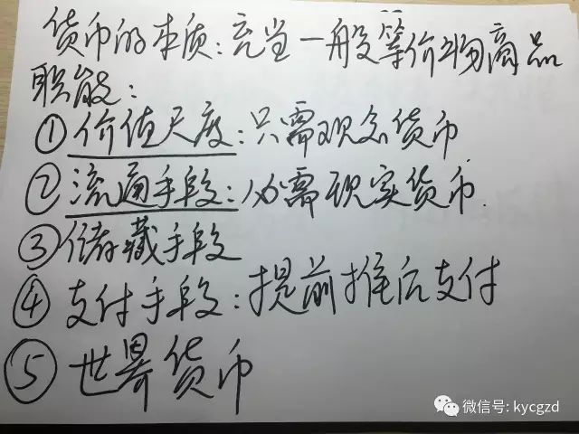

货币是在长期交换过程中形成的固定地充当一般等价物的商品。

货币的职能有五种：**价值尺度**、**流通手段**、储藏手段、**支付手段**和世界货币，其中价值尺度和流通手段是货币最基本的职能。

货币的产生使整个商品世界分化为两极，**商品内在的使用价值和价值的矛盾就发展成为外在的商品和货币的矛盾**。货币出现**有利于解决商品交换的困难，但没有也不可能解决私人劳动和社会劳动的矛盾**。马克思指出，商品转换成货币是“商品惊险的跳跃，跳跃如果不成功摔坏的不是商品，一定是商品占有者”。
