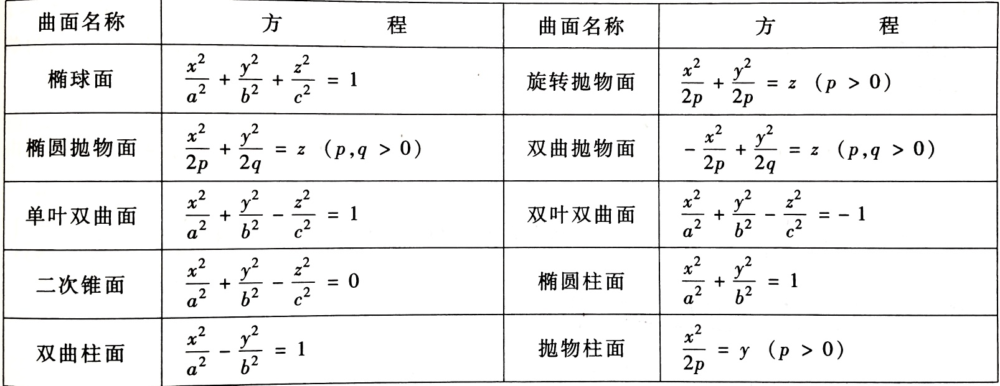

# 向量代数与空间解析几何

## 题型

### ✅ 求向量点积、叉积、夹角

1800：P34.1、P36.16、P36.17、P36.25

- 注意两向量夹角可以大于 $\frac{\pi}{2}$，两直线、直线与平面、两平面夹角不可以
- $\lvert \bf{a} \times \bf{b} \rvert$ 等于 $\bf{a}$ 和 $\bf{b}$ 所围平行四边形面积

### ✅ 判断两直线、直线与平面的关系

1800：P36.13、P113.14

- 两直线方向向量和连接两直线的某个向量的混合积等于 0 则共面，否则异面
- 直线方向向量垂直于平面法向量则与平面平行或在平面内，平行平面法向量则与平面垂直

### ✅ 求符合过定点、平行、垂直、距离等条件的直线或平面

1800：P113.10、P114.15、P114.18

- 利用叉积求方向向量或法向量
- 利用混合积可以直接列出某些平面的方程（找出共面的三个向量，其中一个是 $(x-x_0, y-y_0, z-z_0)$
- 写出平面束方程，求符合条件的参数
- 给出距离之比时，或要求椭球体切平面时，需要注意会有两个符合条件的平面

### ✅ 求距离

1800：P35.9、P112.3、P114.17

- 利用叉积的模等于平行四边形面积的性质
- 利用距离公式
- 求异面直线间距离，先求过其中一条与另一条平行的平面，转化为求点到平面距离

### ✅ 求直线或曲线在平面上的投影

1800：P113.7、P113.8、P113.13

- 求直线投影，先求过直线与平面垂直的平面，两平面交线即投影直线
- 求曲线投影，直接利用曲线方程消去一个变量，注意最后要加上这个变量等于 0 的条件（例如 $z=0$）

### ✅ 求法向量或切平面

1800：P35.11、P113.9

- 将曲面方程分别对 $x$、$y$、$z$ 求导，注意如果方程是 $z=f(x,y)$ 表示的，则法向量是 $(f_x, f_y, -1)$
- 如果要求单位法向量**不要忘记单位化**

### ✅ 求旋转曲面，及其与两平面围成区域的体积和质心

1800：P34.5、P37.27、P113.13、P114.16

- 以绕 $z$ 轴旋转为例，设旋转曲面上一点 $P(x,y,z)$，对应原直线/曲线上点 $P_0(x_0, y_0, z)$，有 $x^2+y^2=x_0^2+y_0^2$，再由原直线/曲线方程得到 $x_0^2=f(z)$ 和 $y_0^2=g(z)$，代入等式即得旋转曲面方程
- 求体积，利用微元法，被积函数为截面面积（以旋转轴变量为自变量）
- 求质心，利用对称性可直接得到两个坐标轴的值，利用质心公式求剩下的一个，最后不要忘记写成完整的坐标形式 $(\bar{x}, \bar{y}, \bar{z})$

## 公式定理

### 距离公式

$P=(x,y,z)$ 是要求距离的外部点，$P_0=(x_0,y_0,z_0)$ 是直线或平面上的某个内部点，$\bf{S}$ 是直线方向向量，$\bf{n}$ 是平面法向量。

#### 点到直线

$$
d = \frac{\lvert \vec{P_0P} \times \bf{S} \rvert}{\lvert \bf{S} \rvert}
$$

#### 点到平面

$$
d = \frac{\lvert \vec{P_0P} \cdot \bf{n} \rvert}{\lvert \bf{n} \rvert}
= \frac{\lvert A(x-x_0) + B(y-y_0) + C(z-z_0) \rvert}{\lvert \bf{n} \rvert}
= \frac{\lvert Ax + By + Cz + D \rvert}{\sqrt{A^2 + B^2 + C^2}}
$$

#### 两平行平面间

$$
d = \frac{\lvert D_2 - D_1 \rvert}{\sqrt{A^2+B^2+C^2}}
$$

#### 二次曲面方程

